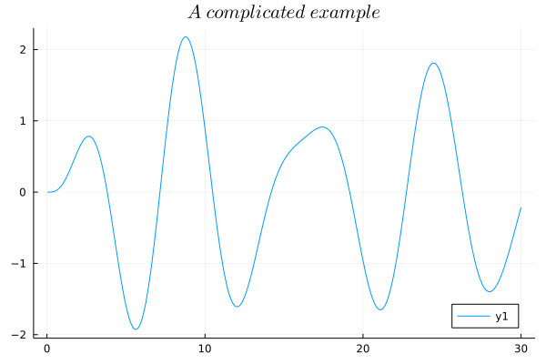

# FractionalDiffEq.jl

<p align="center">

</p>


<p align="center">
  <a href="https://github.com/SciFracX/FractionalDiffEq.jl/actions?query=workflow%3ACI">
    
  </a>
  <a href="https://codecov.io/gh/SciFracX/FractionalDiffEq.jl">
    
  </a>
  <a href="https://scifracx.github.io/FractionalDiffEq.jl/dev/">
    
  </a>
  <a href="https://github.com/SciFracX/FractionalDiffEq.jl/blob/master/LICENSE">
    
  </a>
  <a href="https://zenodo.org/badge/latestdoi/420992306">
  	
  </a>
</p>

<p align="center">
  <a href="https://github.com/SciFracX/FractionalDiffEq.jl/issues">
    
  </a>
  <a href="#">
    
  </a>
  <a href="https://github.com/SciFracX/FractionalDiffEq.jl/network">
    
  </a>
</p>

FractionalDiffEq.jl provides FDE solvers to [DifferentialEquations.jl](https://diffeq.sciml.ai/dev/) ecosystem. There are many performant solvers available, capable of solving many kinds of fractional differential equations.

# Installation

If you have already installed Julia, you can install FractionalDiffEq.jl in REPL using Julia package manager:

```julia
pkg> add FractionalDiffEq
```

# Quick start

### Fractional ordinary differential equations

Let's see if we have an initial value problem:

$$ D^{0.5}y(x)=1-y $$


$$ y(0)=0 $$

So we can use FractionalDiffEq.jl to solve the problem:

```julia
using FractionalDiffEq, Plots
fun(x, y) = 1-y
u0 = 0; tspan = (0, 5); h = 0.001;
prob = SingleTermFODEProblem(fun, 0.5, u0, tspan)
sol = solve(prob, h, PECE())
plot(sol)
```

And if you plot the result, you can see the result of the fractional differential equation:


### A sophisticated example

Let's see if the initial value problem like:

$$ y'''(t)+\frac{1}{16}{^C_0D^{2.5}_t}y(t)+\frac{4}{5}y''(t)+\frac{3}{2}y'(t)+\frac{1}{25}{^C_0D^{0.5}_t}y(t)+\frac{6}{5}y(t)=\frac{172}{125}\cos(\frac{4t}{5}) $$

$$ y(0)=0,\ y'(0)=0,\ y''(0)=0 $$

```julia
using FractionalDiffEq, Plots
h=0.01; tspan = (0, 30)
rightfun(x, y) = 172/125*cos(4/5*x)
prob = MultiTermsFODEProblem([1, 1/16, 4/5, 3/2, 1/25, 6/5], [3, 2.5, 2, 1, 0.5, 0], rightfun, [0, 0, 0, 0, 0, 0], (0, T))
sol = solve(prob, h, PIEX())
plot(sol, legend=:bottomright)
```

Or use the [example file](https://github.com/SciFracX/FractionalDiffEq.jl/blob/master/examples/complicated_example.jl) to plot the numerical approximation, we can see the FDE solver in FractionalDiffEq.jl is amazingly powerful:



### System of Fractional Differential Equations:

FractionalDiffEq.jl is a powerful tool to solve system of fractional differential equations, if you are familiar with [DifferentialEquations.jl](https://github.com/SciML/DifferentialEquations.jl), it would be just like out of the box.

Let's see if we have a Chua chaos system:

$$ \begin{cases}D^{\alpha_1}x=10.725[y-1.7802x-[0.1927(|x+1|-|x-1|)]\\
D^{\alpha_2}y=x-y+z\\
D^{\alpha_3}z=-10.593y-0.268z\end{cases} $$

By using the ```NonLinearAlg``` algorithms to solve this problem:

```julia
using FractionalDiffEq, Plots
function chua!(du, x, p, t)
    a, b, c, m0, m1 = p
    du[1] = a*(x[2]-x[1]-(m1*x[1]+0.5*(m0-m1)*(abs(x[1]+1)-abs(x[1]-1))))
    du[2] = x[1]-x[2]+x[3]
    du[3] = -b*x[2]-c*x[3]
end
α = [0.93, 0.99, 0.92];
x0 = [0.2; -0.1; 0.1];
h = 0.01; tspan = (0, 100);
p = [10.725, 10.593, 0.268, -1.1726, -0.7872]
prob = FODESystem(chua!, α, x0, tspan, p)
sol = solve(prob, h, NonLinearAlg())
plot(sol, vars=(1, 2), title="Chua System", legend=:bottomright)
```

And plot the result:


## Fractional Partial Differential Equations

FractionalDiffEq.jl provides powerful algorithms to solve fractional partial differential equations, let's see a diffusion equation here:

$$ _{0}^{C}\!D_{t}^{\alpha}y- \frac{\partial^\beta y}{\partial |x|^\beta} = f(x,t) $$

With initial and boundry conditions:

$$ y(0,t) = 0, \quad y(1,t) = 0 \quad y(x,0) = 0 $$


Use the FPDE solvers in FractionalDiffEq.jl and plot the numerical approximation:


## Fractional Delay Differential Equations

There are also many powerful solvers for solving fractional delay differential equations.

$$ D^\alpha_ty(t)=3.5y(t)(1-\frac{y(t-0.74)}{19}) $$

$$ y(0)=19.00001 $$


With history function:

$$ y(t)=19,\ t<0 $$

```julia
using FractionalDiffEq, Plots
ϕ(x) = x == 0 ? (return 19.00001) : (return 19.0)
f(t, y, ϕ) = 3.5*y*(1-ϕ/19)
h = 0.05; α = 0.97; τ = 0.8; T = 56
fddeprob = FDDEProblem(f, ϕ, α, τ, T)
V, y = solve(fddeprob, h, DelayPECE())
plot(y, V, xlabel="y(t)", ylabel="y(t-τ)")
```


# Available Solvers

For more performant solvers, please refer to the [FractionalDiffEq.jl Solvers](https://scifracx.org/FractionalDiffEq.jl/dev/algorithms/) page.
# Road map

* More performant algorithms
* Better docs
* More interesting ideas~

# Contributing

If you are interested in Fractional Differential Equations and Julia, welcome to raise an issue or file a Pull Request!!