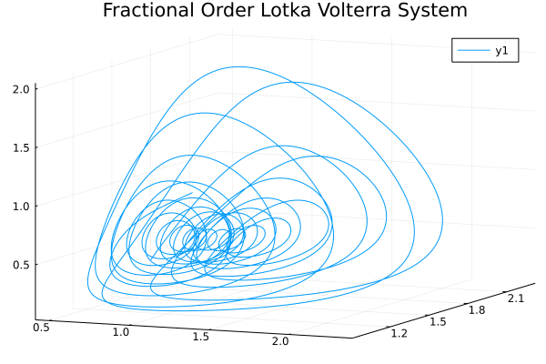

# Fractional Order Lotka Volterra System

```julia
using FractionalDiffEq

h=0.005
alpha = [0.95, 0.95, 0.95]
x0 = [1, 1.4, 1]
tf=50
function f(t, x, y, z, k)
    a, b, c, d, e, p, s = 1, 1, 1, 1, 2, 3, 2.7
    if k == 1
        return a*x+e*x^2-b*x*y-s*z*x^2
    elseif k == 2
        return -c*y+d*x*y
    elseif k == 3
        return -p*z+s*z*x^2
    end
end
prob = FODESystem(f, alpha, x0)
result = solve(prob, h, tf, GLWithMemory())

using Plots
plot3d(result[:, 1], result[:, 2], result[:, 3], title="Fractional Order Lotka Volterra System")
```

