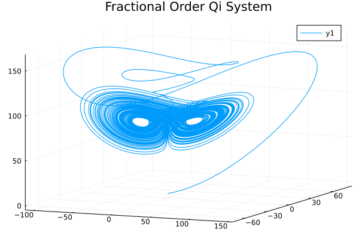

# Fractional Order Qi System

Since the Qi chaotic system is depicted as:

```math
\begin{cases}
\dot{x_1}=a(x_1-x_2)+x_2x_3\\
\dot{x_2}=cx_1-x_2-x_1x_3\\
\dot{x_3}=x_1x_2-bx_3
\end{cases}
```

We can also obtain the fractional order Qi chaotic system:

```math
\begin{cases}
D^\alpha x_1=a(x_1-x_2)+x_2x_3\\
D^\alpha x_2=cx_1-x_2-x_1x_3\\
D^\alpha x_3=x_1x_2-bx_3
\end{cases}
```

```julia
using FractionalDiffEq, Plots

function Qi!(du, u, p, t)
    a, b, c, d, r = 35, 8/3, 80, -1, 1
    du[1] = -a*u[1]+a*u[2]+r*u[2]*u[3]
    du[2] = c*u[1]+d*u[2]-u[1]*u[3]
    du[3] = -b*u[3]+u[1]*u[2]
end

alpha = [0.98, 0.98, 0.98]
h=0.001
T=50
x0=[0.1, 0.2, 0.3]
prob=FODESystem(Qi!, alpha, x0, T)
result = solve(prob, h, GLWithMemory())

plot3d(result[:, 1], result[:, 2], result[:, 3], title="Fractional Order Qi System")
```

