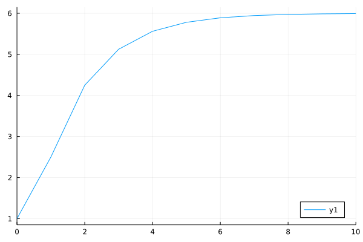

# Fractional Differences Equations

There are also some solvers can be used to solve Fractional Differences Equations in FractionalDiffEq.jl.

Fractional Differences Equations has the form:

```math
\Delta^{\alpha}x(t)=f(t+\alpha,\ x(t+\alpha))
```

With initial condition:

```math
x(0)=x0
```

Let's see an example here, we have a fractional differences equation with initial condition:

```math
\Delta^{0.5}x(t)=0.5x(t+0.5)+1
```

```math
x(0)=1
```

By using the ```PECEDifference``` solver in FractionalDiffEq.jl:

```julia
using FractionalDiffEq, Plots

fun(x) = 0.5*x+1
α=0.5; x0=1;
T=1; h=0.1
prob = FractionalDifferenceProblem(fun, α, x0)
sol=solve(prob, T, h, PECEDifference())
plot(sol, seriestype=:scatter, legend=:bottomright)
```

And plot the solution:

