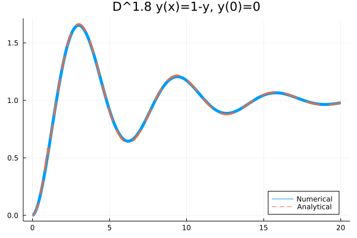

# Get Start

We would use a simple example -- [Relaxation Oscillation Process](https://encyclopediaofmath.org/wiki/Relaxation_oscillation) to show you how to use FractionalDiffEq.jl to solve fractional differential equations.

The mathematical model of the fractional order relaxation oscillation can be abstracted as an IVP:

```math
D^{1.8}y(t)+y(t)=1,\ (t>0)
```

```math
y^{(k)}(0)=0
```

While we can know the analytical solution of this equation is:

```math
u(t)=t^{1.8}E_{1.8,\ 2.8}(-t^{1.8})
```

Here ``E_{\alpha, \beta}(z)`` is the two parametric [Mittag Leffler function](https://scifracx.org/FractionalDiffEq.jl/stable/mittagleffler/).

We can solve this problem by the following code using FractionalDiffEq.jl:

```julia
using FractionalDiffEq, Plots
fun(u, p, t) = 1-u
α=1.8; tspan = (0, 20); u0 = [0, 0]
prob = FODEProblem(fun, α, u0, tspan)
sol = solve(prob, PIEX(), dt=0.01)
plot(sol)
```

By plotting the numerical result, we can get the approximation result:



To provide users with a simple way to solve fractional differential equations, we follow the design pattern of [DifferentialEquations.jl](https://github.com/SciML/DifferentialEquations.jl), so it would be the same way to use FractionalDiffEq.jl as DifferentialEquations.jl, we are supporting more and more similar features in FractionalDiffEq.jl such as callback functions, sensitivity analysis etc.

## Step 1: Defining a Problem

First, we need to specify the problem we want to solve. Just by passing the parameters —— the right hand side function, fractional orders, initial conditions and time span to construct a fractional ordinary differential equation problem:

```julia
using FractionalDiffEq
fun(u, p, t) = 1-u
α = 1.8; u0 = [0, 0]; tspan = (0, 20); dt = 0.01;
prob = FODEProblem(fun, α, u0, tspan)
```

The ```FODEProblem``` is a class of fractional differential equations, describing equations with ``D^{\alpha}u=f(t, u)`` pattern. For other patterns and classes of fractional differential equations, please refer to [Problem types](@ref problems)

## Step 2: Solving a Problem

After defining a problem, we can solve it by choosing a numerical algorithm and calling the ```solve``` function:

```julia
sol = solve(prob, Alg(), dt=0.01)
```

Note that there are different algorithms for different fractional differential equations, such as FODE, FDDE and DODE, we need to choose a suitable algorithm for a specific problem. For all the algorithms, please refer to [the algorithms documentation](@ref algorithms).

## Step 3: Analyzing the Solution

Simply call the Plots.jl to visualize the solution:

```julia
using Plots
plot(sol)
```

