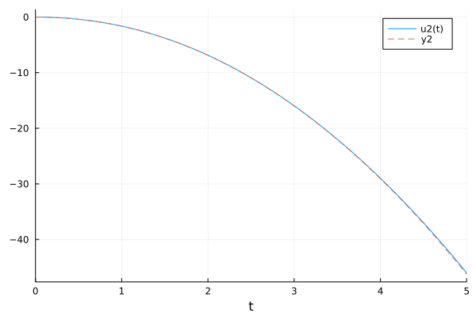

# Solving ODE usng solvers in FractionalDiffEq.jl

While the fractional differential equations are the generalization of the integer order differential equations, we maybe wonder: Can FractionalDiffEq.jl solve ODEs? The answer would be a big YES!!

Long story short, let's see the comparison with [OrdinaryDiffEq.jl](https://github.com/SciML/OrdinaryDiffEq.jl):

## Single term ODE

For example, we have a second order ODE:

```math
y''-y=2x^2-x-3,\ y'(0)=0,\ y(0)=0
```


```julia
using OrdinaryDiffEq, FractionalDiffEq, Plots
function fun(du, u, p, x)
    du=u+2*x^2-x-3
end

odeprob = SecondOrderODEProblem(fun, 0, 0, (0, 5))
odesol = OrdinaryDiffEq.solve(odeprob, Tsit5())
# For now, when we are using solve to solve our problem, we need to specify packages explicitly
fodeprob = SingleTermFODEProblem((x, u)->u+2*x^2-x-3, 2, 0, (0, 5))
fodesol = FractionalDiffEq.solve(fodeprob, 0.001, PECE())

plot(sol, vars=(2))
plot!(fodesol, ls=:dash)
```



## Linear multi-term ODE:

```math
y''-9y'+20y=0,\ y'(0)=2, y(0)=1
```

While the analytical solution is given as:

```math
y(x)=e^{4x}(3-2e^x)
```

```julia
using FractionalDiffEq, Plots
rightfun(t, x) = 0
multiprob = MultiTermsFODEProblem([1, -9, 20], [2, 1, 0], rightfun, [1, 2], (0, 1))
multisol = FractionalDiffEq.solve(multiprob, 0.01, PIPECE())
analytical(x)=exp(4*x)*(3-2*exp(x))
plot(multisol)
plot!(collect(0:0.01:1), analytical.(collect(0:0.01:1)), ls=:dash)
```

